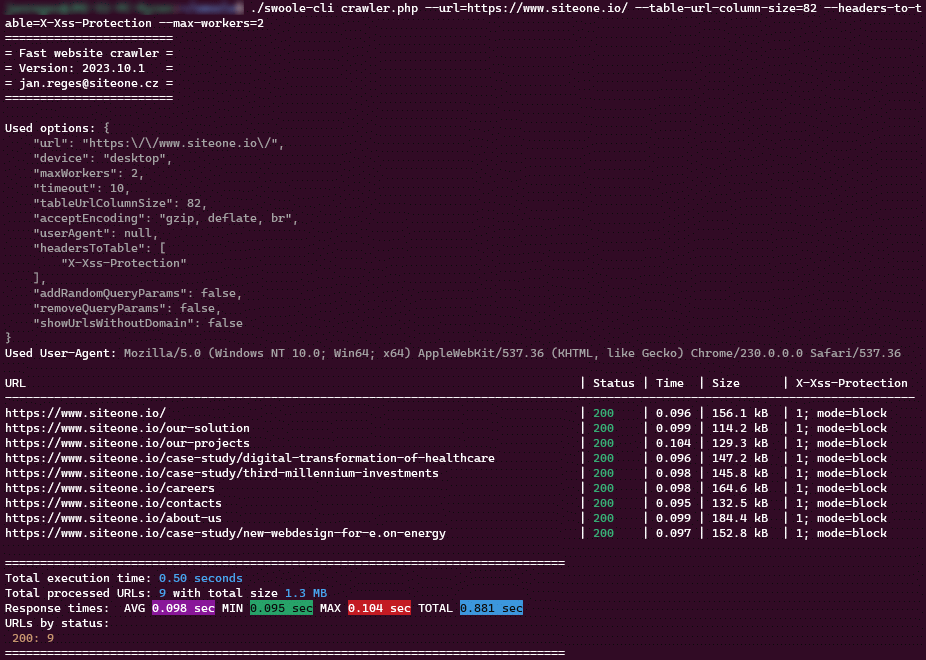

# Fast website crawler

Fast website crawler is an easy-to-use script for Linux that crawls and fetches URLs from a website.

The motivation to create this tool? At [siteone.io](https://www.siteone.io/) we develop various web applications or presentations that we need to completely crawl and check speeds, DoS/DDoS mitigations, status codes, cache settings, find non-existent pages, redirects, etc. This tool solves all our needs at once.

## Features

* No external dependencies, no complicated installation. It works well with **any modern Linux distribution**.
* Efficiently crawls the website starting from the provided URL.
* Uses Swoole's coroutine capability for concurrency and high performance.
* Dynamic User-Agent string based on selected `--device` type with the option to override by `--user-agent`.
* Option to add random query parameters to the URLs to test cache behavior.
* Beautifully formatted console output with colored statuses. See screenshot below.
* Displays execution statistics at the end, including AVG, MIN, and MAX response times and breakdown by HTTP status codes.
* Output - the script provides a detailed table-like output which includes:
* * Crawled URLs
* * Status code of the HTTP response (colored based on the status)
* * Time taken for the HTTP request (colored based on the time)
* * Response size
* * Specified headers from the HTTP response (based on `--headers-to-table` argument)
* * Furthermore, the script provides summary statistics at the end of its execution, showing details like the total number of URLs processed, breakdown by HTTP status codes, and total, average, min, and max response times.

## Roadmap

* Support for crawling assets (images, CSS, JS, etc.) and display statistics for them.
* Support for JSON output for better integration with CI/CD pipelines and other tools.
* Support for configurable thresholds for response times, status codes, etc. to exit with a non-zero code.

If you have any suggestions or feature requests, please open an issue on GitHub. We'd love to hear from you!

Your contributions with realized improvements, bug fixes, and new features are welcome. Please open a pull request :-)

## Installation

```bash
git clone https://github.com/janreges/fast-website-crawler.git
cd fast-website-crawler
chmod +x ./swoole-cli
````

## Usage

To run the script, execute the `crawler.php` file from the command line with pre-compiled `swoole-cli` and provide the required arguments:

**Basic example**

```bash
./swoole-cli crawler.php --url=https://mydomain.tld/ --device=mobile
```

**Fully-featured example**

```bash
./swoole-cli crawler.php --url=https://mydomain.tld/ \
  --max-workers=2 \
  --user-agent="My User-Agent String" \
  --headers-to-table="X-Cache,Server" \
  --accept-encoding="gzip, deflate" \
  --timeout=5 \
  --table-url-column-size=80 \
  --max-queue-length=3000 \
  --max-visited-urls=10000 \
  --max-url-length=5000 \
  --remove-query-params \
  --add-random-query-params \
  --show-urls-without-domain
```

### Arguments

#### Required:

* `--url=<value>`: The starting URL to begin crawling from.

#### Optional:

* `--device=<string>`: Specify the device type. Options: `desktop`, `mobile`, `tablet`. Defaults to `desktop` if not specified.
* `--max-workers=<num>`: The maximum number of workers for concurrent URL processing. Defaults to `3` if not specified.
* `--user-agent="<string>"`: The User-Agent string to use for the HTTP requests. If not provided, it defaults based on the `device` argument.
* `--headers-to-table=<string>`: Specify which extra headers from the HTTP response to display in the table output. Comma delimited.
* `--accept-encoding=<string>`: Accept-Encoding header value. Defaults to `gzip, deflate, br` if not specified.
* `--timeout=<seconds>`: Timeout duration in seconds for the HTTP requests. Defaults to `10` seconds if not specified.
* `--table-url-column-size=<num>`: Basic URL column size in chars. Defaults to `120` chars if not specified.
* `--max-queue-length=<num>`: The maximum length of the waiting URL queue. Increase in case of large websites, but expect higher memory requirements. Defaults to `1000` if not specified.
* `--max-visited-urls=<num>`: The maximum number of the visited URLs. Increase in case of large websites, but expect higher memory requirements. Defaults to `5000` if not specified.
* `--max-url-length=<num>`: The maximum supported URL length in chars. Increase in case of very long URLs with query params, but expect higher memory requirements. Defaults to `2000` if not specified.
* `--add-random-query-params`: Whether to add random query parameters to the URL. This can help in testing cache behavior.
* `--remove-query-params`: Whether to remove all query parameters from the parsed URLs.
* `--show-urls-without-domain`: If set, URLs displayed in the output table will not include the domain.

## Dependencies

Make sure you have the Swoole extension installed in your PHP environment to leverage the coroutine functionality.

## Disclaimer

Please use responsibly and ensure that you have the necessary permissions when crawling websites. Some sites may have rules against automated access detailed in their robots.txt.

## License

The script is provided as-is without any guarantees. You're free to modify, distribute, and use it as per your requirements.

## Screenshot

